# Job Import Data Flow

前端粘贴 Job URL → 数据库落库的完整过程。

---

## 全局架构

```
┌─────────────────────────────────────────────────────────────────────────┐
│  Frontend (Next.js 16 / React 19 / TypeScript)                         │
│  app/frontend/src/                                                      │
│    app/jobs/page.tsx              ← Job 列表页                          │
│    components/jobs/job-form.tsx   ← 输入 URL 的模态框                    │
│    lib/api/client.ts              ← API 调用层                          │
└──────────────────────┬──────────────────────────────────────────────────┘
                       │ HTTP (POST /api/jobs/import)
                       ▼
┌─────────────────────────────────────────────────────────────────────────┐
│  Backend (Python FastAPI / Async SQLAlchemy 2.0 / PostgreSQL 16)       │
│  app/backend/app/modules/                                               │
│    jobs/routes.py        ← 路由处理器，校验参数                          │
│    jobs/importer.py      ← 核心：爬取 URL + 组装 ScrapedJob + 编排入库   │
│    jobs/repository.py    ← DB 操作：create_job / sync_job_skills        │
│    matching/service.py   ← 技能解析：LLM 或规则引擎                      │
│  app/backend/app/db/                                                    │
│    models.py             ← ORM：JobPosting / JobSkill / MatchReport     │
└──────────────────────┬──────────────────────────────────────────────────┘
                       │ SQL
                       ▼
┌─────────────────────────────────────────────────────────────────────────┐
│  PostgreSQL 16                                                          │
│  写入：job_postings (1 条) + job_skills (N 条)                          │
└─────────────────────────────────────────────────────────────────────────┘
```

---

## 详细数据流

```mermaid
flowchart TB
    %% ─── 样式 ───
    classDef frontend fill:#E8F5E9,stroke:#388E3C,color:#1B5E20
    classDef backend fill:#E3F2FD,stroke:#1976D2,color:#0D47A1
    classDef db fill:#FFF3E0,stroke:#F57C00,color:#E65100
    classDef decision fill:#F3E5F5,stroke:#7B1FA2,color:#4A148C
    classDef note fill:#FFF9C4,stroke:#FBC02D,color:#F57F17

    %% ─── Frontend ───
    A(["用户点击 'Add Job'"]):::frontend
    B["弹出 JobForm 模态框"]:::frontend
    C(["用户粘贴 URL，点击 'Import Jobs'"]):::frontend
    D["client.ts: importJobs(urlText)<br/>① 按空格/逗号分割<br/>② 去重<br/>③ 校验 URL 格式"]:::frontend
    E["POST /api/jobs/import { urls: [...] }"]:::frontend

    A --> B --> C --> D --> E

    %% ─── Backend: 路由 ───
    F["routes.py: import_jobs_endpoint<br/>校验：urls 非空，≤ 10 个"]:::backend
    E --> F

    %% ─── Backend: 循环每个 URL ───
    G["importer.py: import_job_urls()<br/>遍历每个 URL"]:::backend
    F --> G

    subgraph PER_URL ["每个 URL 的处理流程"]
        direction TB

        %% 爬取
        H["scrape_job_url(url)"]:::backend
        H1["① httpx GET → HTML<br/>User-Agent: Chrome 125"]:::backend
        H2["② 提取 JSON-LD<br/>(@type = JobPosting)"]:::backend
        H3["③ fallback 1: OG meta 标签<br/>(og:title, og:description)"]:::backend
        H4["④ fallback 2: 页面 title"]:::backend
        H5["⑤ 组装 ScrapedJob<br/>title / company / url / location /<br/>raw_jd / source / salary / ..."]:::backend

        H --> H1 --> H2 --> H3 --> H4 --> H5

        %% 查重
        I["SELECT job_posting<br/>WHERE url = scraped.url"]:::backend
        H5 --> I

        J{"记录已存在？"}:::decision
        I --> J

        %% 更新已有
        K["UPDATE 已有记录<br/>title, company, location, raw_jd<br/>重置 parsed_json = null<br/>status = 'imported'"]:::backend
        J -->|"是"| K

        %% 创建新
        L["repository.py: create_job()<br/>INSERT INTO job_postings<br/>(tenant_id, title, company, url,<br/>raw_jd, location, source, ...)<br/>status = 'new'"]:::backend
        J -->|"否"| L

        %% 技能解析
        M["matching/service.py: parse_job_posting()<br/>force=True"]:::backend
        K --> M
        L --> M

        N{"deepseek_api_key 存在？"}:::decision
        M --> N

        O["LLM 解析：调用 DeepSeek API<br/>prompt 要求返回结构化 JSON<br/>(must_have_skills, nice_to_have_skills,<br/>responsibilities, seniority, salary...)<br/>temperature=0, max_tokens=2000"]:::backend
        N -->|"是"| O

        OO["规则增强 _enrich_parsed_skills()<br/>按 JD section 补充技能<br/>剔除 'What this role is NOT' 中的技能"]:::backend
        O --> OO

        P["规则解析 _deterministic_parse()<br/>正则匹配 70+ 预定义技能关键词<br/>提取 seniority / salary / 地点 / 语言"]:::backend
        N -->|"否 / LLM 失败"| P

        PP["规则增强 _enrich_parsed_skills()"]:::backend
        P --> PP

        Q["UPDATE job_postings<br/>SET parsed_json = {...}, status = 'parsed'"]:::backend
        OO --> Q
        PP --> Q

        %% 技能写入
        R["repository.py: sync_job_skills()"]:::backend
        Q --> R

        R1["DELETE FROM job_skills<br/>WHERE job_id = job.id"]:::db
        R --> R1

        R2["INSERT INTO job_skills × N<br/>(tenant_id, job_id, name,<br/>category, source)"]:::db
        R1 --> R2
    end

    G --> PER_URL

    %% ─── 返回 ───
    S["get_job(db, job.id)<br/>重新查询 + 附带 MatchReport + skills"]:::backend
    PER_URL --> S
    T["返回 list[JobResponse] → 前端"]:::backend
    S --> T

    %% ─── 前端更新 ───
    U["page.tsx: 合并 jobs 状态<br/>关模态框"]:::frontend
    V(["用户看到新 Job 卡片"]):::frontend
    T --> U --> V

    %% ─── 图例 ───
    subgraph Legend ["图例"]
        L1:::frontend
        L2:::backend
        L3:::db
        L4:::decision
    end
```



---

## 落库结果（每个 URL）

| 表 | 写入条数 | 关键字段 |
|---|---|---|
| **`job_postings`** | 1 条 | `title`, `company`, `url`, `raw_jd`, `parsed_json`(JSONB), `scraped_json`(JSONB), `status` |
| **`job_skills`** | N 条 | `job_id`, `name`(技能名), `category`(must_have/nice_to_have), `source`(deepseek/deterministic_parser) |

---

## 关键文件对照

| 步骤 | 文件 |
|---|---|
| 前端 "Add Job" 按钮 | `app/frontend/src/app/jobs/page.tsx` |
| 前端 URL 输入模态框 | `app/frontend/src/components/jobs/job-form.tsx` |
| 前端 API 调用 + 格式校验 | `app/frontend/src/lib/api/client.ts` (第 72 行 `importJobs`) |
| 后端路由 + 参数校验 | `app/backend/app/modules/jobs/routes.py` (第 37 行) |
| 后端 URL 爬取 + 编排 | `app/backend/app/modules/jobs/importer.py` (第 242 行 `scrape_job_url`, 第 322 行 `import_job_urls`) |
| 后端 DB 创建 + 技能同步 | `app/backend/app/modules/jobs/repository.py` (第 119 行 `create_job`, 第 95 行 `sync_job_skills`) |
| 后端 LLM/规则技能解析 | `app/backend/app/modules/matching/service.py` (第 345 行 `parse_job_posting`) |
| 数据库 ORM 模型 | `app/backend/app/db/models.py` (第 90 行 `JobPosting`, 第 117 行 `JobSkill`) |
